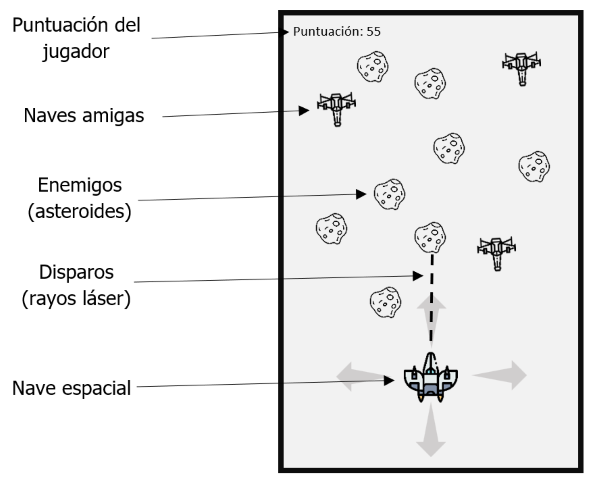

 # Creación de Video Juegos
 
 ## Contenido
- [Introducción al projecto a realizar](#introducción)
- [Código Fuente de los cursos unity](#código-fuente)
- [Autor](#autor)

## Introducción

- Nombre del proyecto
  - Space Shooter

- Objetivo
  - Derribar asteroides sin dejar que estos nos golpean, y evitar destruir naves amigas

- Plataforma ,Género, Clasificación, Personajes, Escenario.
  - Plataforma: 
    - Desktop
  - Género:
    - Aventura
    - Disparos
  - Clasificación:
    - Everyone E, contenido apto para todas las edades  
  - Personajes:
    - Nave Discovery One
  - Escenario:
    - Espacio exterior 

- Historia
  - Es el año 3050, la humanidad tuvo que escapar del planeta tierra y en busca de un nuevo hogar, la nave Discovery One tiene la misión de encontrar un lugar seguro para los habitantes del planeta tierra, aventurándose dentro del espacio y esquivando todo tipo adversidades que se encuentre en su camino. 

- Reglas de Juego.
  - El propósito del player (Nave) es destruir los objetos (Meteoritos) que van hacia la posición Z de la escena, evitando que ambos choquen, en caso de suceder una collision entre el meteorito y la nave espacial se terminará el juego. Habrá dos tipos de objetos Meteoritos y Naves amigas,  el primero (Meteorito) será de tipo acumulador, el cuál aumentará los puntos de 5 en 5. El segundo (Nave conocido) será de tipo desacumulativo, el cuál disminuirá los puntos de 2 en 2. En caso de llegar a los 100 puntos se ganará la partida.

- Pantallas de Juego
  - Escena del juego
    - 

- Plan de creación de VideoJuego
  - [Tablero en Trello](https://trello.com/b/YE2REfxC/space-shooter)

- Autores del projecto Space Shooter
  - Ramírez Balderas Florentino - 1219100383
  - Hernández Salazar Diego Joan - 1219100490
  
* Documentación detallada Space Shooter
  * > [Documentación del juego a realizar](https://docs.google.com/document/d/1WzagRw2U7oY4eAUA6eFMaBPmHoLrkz6q/edit?usp=sharing&ouid=104069290293159397537&rtpof=true&sd=true)

## Código Fuente
* Lección 1 - Payer Control
  * > [Unit 1 - Player Control ](https://github.com/DiegoJoan2145/Curso-Unity/tree/main/Leccion%201/Unit%201%20-%20Player%20Control)
  * > [Desafío 1 - Plane Programming ](https://github.com/DiegoJoan2145/Curso-Unity/tree/main/Leccion%201/Challenge%201%20-%20Plane%20Programming)
  * > [Video 1 - Plane Programming](https://drive.google.com/file/d/1l2nb43hen2pZP2RzAebepxHwWcXBPlXe/view?usp=sharing)
  * > [Laboratorio - 1](https://github.com/DiegoJoan2145/Curso-Unity/tree/main/Leccion%201/Laboratorio%20-%201)
  * > [Quiz - 1](https://github.com/DiegoJoan2145/Curso-Unity/tree/main/Leccion%201/Quiz%20-%201)
  
* Lección 2 - Basic GamePlay 
  * > [Unit 2 - Basic Gamplay ](https://github.com/DiegoJoan2145/Curso-Unity/tree/main/Leccion%202/Unit%202%20-Basic%20Gameplay)
  * > [Desafío 2 - Play Fetch ](https://github.com/DiegoJoan2145/Curso-Unity/tree/main/Leccion%202/Challenge%202%20-%20Play%20Fetch)
  * > [Video 2 - Play Fetch](https://drive.google.com/file/d/1OjIuS5L2ZLEBPcpD_CGUD39cnimJNFo0/view?usp=sharing)
  * > [Laboratorio - 2](https://github.com/DiegoJoan2145/Curso-Unity/tree/main/Leccion%202/Lab%20-%20New%20Project%20with%20primitives)
  * > [Quiz - 2](https://github.com/DiegoJoan2145/Curso-Unity/tree/main/Leccion%202/Quiz%20-%202)

* Lección 3 - Sound and Efffects
  * > [Unit 3 - Sound and Efffects ](https://github.com/DiegoJoan2145/Curso-Unity/tree/main/Leccion%203/Unit%203%20-%20Sound%20and%20Effects)
  * > [Desafío 3 - Balloons, Bombs, & Booleans](https://github.com/DiegoJoan2145/Curso-Unity/tree/main/Leccion%203/Unit%203%20-%20Challenge)
  * > [Video 3 - Balloons, Bombs, & Booleans](https://drive.google.com/file/d/1bhGzxDb_axJuCxzOpWJ0DVhg5uq_mozr/view?usp=sharing)
  * > [Laboratorio 3 - Player Control](https://github.com/DiegoJoan2145/Curso-Unity/tree/main/Leccion%203/Laboratorio%20-%203)
  * > [Quiz - 5](https://github.com/DiegoJoan2145/Curso-Unity/tree/main/Leccion%203/Quiz%20-%203)
 
* Lección 4 - Game play mechanics
  * > [Laboratorio 4 - Basic GamePlay](https://github.com/DiegoJoan2145/Curso-Unity/tree/main/Leccion%204/Lab%204%20-%20Basic%20Gameplay)

* Lección 5 - User Interface
  * > [Unit 5 - User Interface](https://github.com/DiegoJoan2145/Curso-Unity/tree/main/Leccion%205/Unit%205%20-%20User%20Interface)
  * > [Desafío 5 - Whack-a-Food](https://github.com/DiegoJoan2145/Curso-Unity/tree/main/Leccion%205/Challenge%205%20-%20Whack-a-Food)
  * > [Video 5 - Whack-a-Food](https://drive.google.com/file/d/1AurE0HmEXepgv_Be__k9fUJA-I4GR5ce/view?usp=sharing)
  * > [Laboratorio 5 - Swap out your assets](https://github.com/DiegoJoan2145/Curso-Unity/tree/main/Leccion%205/Lab%205%20-%20Swap%20out%20your%20Assets)
  * > [Quiz - 5](https://github.com/DiegoJoan2145/Curso-Unity/tree/main/Leccion%205/Quiz%20-%205)

## Autor
- Hernández Salazar Diego Joan
- Número de control: 1219100490
- Grupo: GDGS2101
