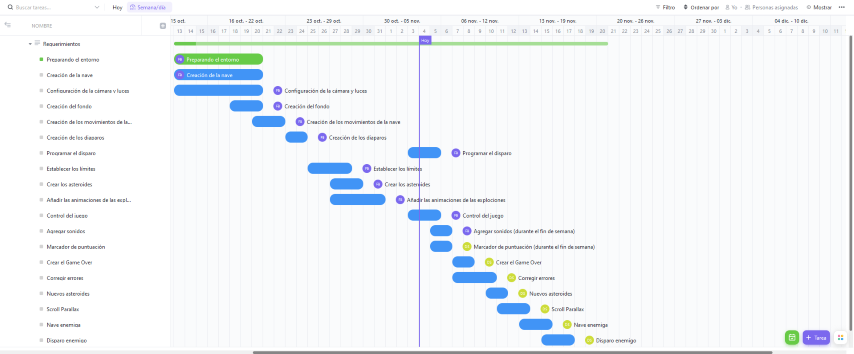

 # Creación de Video Juegos
 
 ## Contenido
- [Introducción al projecto a realizar](#introducción)
- [Código Fuente de los cursos unity](#código-fuente)
- [Autor](#autor)

## Introducción

- Nombre del proyecto
  - Space Escape

- Objetivo
  - Derribar asteroides sin dejar que estos nos golpean, y evitar destruir naves amigas

- Plataforma ,Género, Clasificación, Personajes, Escenario.
  - Plataforma: 
    - Desktop
  - Género:
    - Aventura y Disparos
  - Clasificación:
    - Everyone E, contenido apto para todas las edades  
  - Personajes:
    - Nave Destructor Estelar, Nave de Control de Droides clase Lucrehulk
  - Escenario:
    - Espacio exterior, dentro de la nébula darkgreen
  - Tipo de Juego
    - 3D

- Historia
  - Es el año 3074, en el planeta Xandar dentro de la nébula darkgreen ahí se encuentra lo más preciado del universo la estrella del alma, el cual es de altamente valor, donde los Chandilar logran robar esta preciada reliquia, huyen dentro de la nave llamada Destructor Estelar llamada así por sus gran tamaño, y su poder de destrucción que tan solo viéndola es de imponer respeto, los Chandilar se tienen que enfrentar a muchas adversidades como la lluvia de meteoritos que es una característica de la nébula darkgreen, pero no solo de eso se deben de preocupar si no también deben escapar de la guardia galáctica donde tienen naves es la de Control de Droides clase Lucrehulk, caracterizada por su forma en punto y sus destructores rayos lazer los cuales deben de evitar a toda costa. 

- Reglas de Juego.
  - El jugador debe de destruir o esquivar los asteroides, así como las naves
  - El juego termina si:
    - Si el jugador chocado por un asteroide
    - Si es impactado por un rayo láser de las naves
    - Si el jugador tiene una colisión con una nave el juego se termina
  - Puntuación:
    - Destrucción de:
      - Ateroide de hielo   = +1  puntos
      - Asteroide de lava  = +3  puntos
      - Mina   = +5 puntos
      - Nave enemiga       = +10 puntos
  - Disparos:
	  - Solo tendrá 4 disparos por segundo
  - Control del juego
    - [Ver controles del juego](img/control-del-juego.png)
  - Vidas:
	  - 1 vida
  - Dificultad 
	  - Acumulativa (+5 asteroides cada ronda)
    - Velocidad acumulativa (+5 en cada ronda)
	  - Tiempo de espera de 5 segundos entre ronda
	  - Probabilidad de 14% que aparezca alguna nave enemiga

- Pantallas de Juego
  - Escena del juego
    - 

- Plan de creación de VideoJuego
  - [Tablero Space Escape](https://sharing.clickup.com/24530945/g/h/qcm01-85/b473a7031a11b6d)
  - 

- Presentación 
  - [Diapositiva del juego](https://docs.google.com/presentation/d/1ocMP9lEPDD4IMZThTxKA5phMRXpEa3Rm/edit?usp=sharing&ouid=104069290293159397537&rtpof=true&sd=true)

- Configuración del entorno para el juego 
  - **IMPORTANTE:** Para tener una mejor experiencia es necesario agregar un nuevo aspecto, por lo que se recomienda ir al apartado de **Game** después dirigirse a **Free Aspect** y oprimir el símbolo de **+**, posteriormente agregaremos uno nuevo **Label** con el nombre que sea recomendamos **Space Shooter** después el **Width & Height** pondremos **600 x 900**
  - [Manual](img/Manual.png)

- Versiones 
  - Versión 1: 
    - Se agrego el plano con una textura de nébula 
    - Se agrego la nave igual que se hace que pueda moverse sin salirse del plano además de disparar
    - Se agregaron los meteoritos y cada uno tiene un movimiento diferente
    - Espaunean los meteoritos 
    - Se destruyen todos los objetos que salen del cuadro 
    - Se agregaron las animaciones de explosiones 
    - Se agrego el sonido 
    - Se agregaron los scripts que destruyen a los asteroides y a la nave 
    - [Space Escape V1](https://github.com/Florentinorm/Curso_Unity/blob/main/Space%20Shooter/Space%20Shooter%20V1.unitypackage)

  - Versión 2:
    - Se agrego la puntuación (Score)
    - Se agrego el Juego terminado (Game Over)
    - Se agrego una manera de reiniciar el juego
    - Se agregaron nuevos asteroides con puntuación y velocidades distintas
    - Se implemento la funcionalidad que con cada ronda aumenten (+5) los asteroides
    - A cada tipo de asteroide se le asignó un valor
    - Se implemento la velocidad de los asteroides (+5) conforme cada ronda pase
    - [Space Escape V2](https://github.com/Florentinorm/Curso_Unity/blob/main/Space%20Escape/Space%20Escape%20V2.unitypackage)

  - Versión 3:
    - Se crea el scroll parallax, que hace que el fondo tenga movimiento
    - Se agregaron estrellas al escenario
    - Se creo la nave enemiga
    - Se creo la manera en que pueda disparar
    - [Space Escape V3](https://github.com/Florentinorm/Curso_Unity/blob/main/Space%20Escape/Space%20Escape%20V3.unitypackage)

  - Versión 4:
    - Se cambio el diseño de las naves
    - Se agregaron minas, asteroides de lava y hielo 
    - Se cambio el fonde de la nébula por uno de mas colores
    - Se agrego la manera en que las naves enemigas puedan moverse dentro del plano
    - [Space Escape V4](https://mega.nz/file/uj4GFR6K#S1npGcycgjfnHDc5N_l1IfArCyzKDpVbklS-29O25JE) *(Importación desde MEGA, peso estimado 157 MB)*

  - Versión 5:
    - Se agrego la conexión a la Base de Datos
    - Se registra el usuario
    - Se registra su puntuación 
    - Se muestra la tabla con las mejores puntuaciones 
    - Se agrego la UI de inicio
    - [Space Escape V5](https://mega.nz/file/XzhmmYrT#1SrQIQPiL7AxR6hppJOGqehFJKNVYGMo2x5O6WFOiU4) *(Importación desde MEGA, peso estimado 160 MB)*

- Autores del juego "Space Escape"
  - Ramírez Balderas Florentino - 1219100383
  - Hernández Salazar Diego Joan - 1219100490

## Código Fuente
* Lección 1 - Payer Control
  * > [Unit 1 - Player Control ](https://github.com/DiegoJoan2145/Curso-Unity/tree/main/Leccion%201/Unit%201%20-%20Player%20Control)
  * > [Desafío 1 - Plane Programming ](https://github.com/DiegoJoan2145/Curso-Unity/tree/main/Leccion%201/Challenge%201%20-%20Plane%20Programming)
  * > [Video 1 - Plane Programming](https://drive.google.com/file/d/1l2nb43hen2pZP2RzAebepxHwWcXBPlXe/view?usp=sharing)
  * > [Laboratorio - 1](https://github.com/DiegoJoan2145/Curso-Unity/tree/main/Leccion%201/Laboratorio%20-%201)
  * > [Quiz - 1](https://github.com/DiegoJoan2145/Curso-Unity/tree/main/Leccion%201/Quiz%20-%201)
  
* Lección 2 - Basic GamePlay 
  * > [Unit 2 - Basic Gamplay ](https://github.com/DiegoJoan2145/Curso-Unity/tree/main/Leccion%202/Unit%202%20-Basic%20Gameplay)
  * > [Desafío 2 - Play Fetch ](https://github.com/DiegoJoan2145/Curso-Unity/tree/main/Leccion%202/Challenge%202%20-%20Play%20Fetch)
  * > [Video 2 - Play Fetch](https://drive.google.com/file/d/1OjIuS5L2ZLEBPcpD_CGUD39cnimJNFo0/view?usp=sharing)
  * > [Laboratorio - 2](https://github.com/DiegoJoan2145/Curso-Unity/tree/main/Leccion%202/Lab%20-%20New%20Project%20with%20primitives)
  * > [Quiz - 2](https://github.com/DiegoJoan2145/Curso-Unity/tree/main/Leccion%202/Quiz%20-%202)

* Lección 3 - Sound and Efffects
  * > [Unit 3 - Sound and Efffects ](https://github.com/DiegoJoan2145/Curso-Unity/tree/main/Leccion%203/Unit%203%20-%20Sound%20and%20Effects)
  * > [Desafío 3 - Balloons, Bombs, & Booleans](https://github.com/DiegoJoan2145/Curso-Unity/tree/main/Leccion%203/Unit%203%20-%20Challenge)
  * > [Video 3 - Balloons, Bombs, & Booleans](https://drive.google.com/file/d/1bhGzxDb_axJuCxzOpWJ0DVhg5uq_mozr/view?usp=sharing)
  * > [Laboratorio 3 - Player Control](https://github.com/DiegoJoan2145/Curso-Unity/tree/main/Leccion%203/Laboratorio%20-%203)
  * > [Quiz - 5](https://github.com/DiegoJoan2145/Curso-Unity/tree/main/Leccion%203/Quiz%20-%203)
 
* Lección 4 - Game play mechanics
  * > [Unit 4 - GamePlay Mechanics](https://github.com/DiegoJoan2145/Curso-Unity/tree/main/Leccion%204/Unit%204%20-%20Gameplay%20Mechanics)
  * > [Desafio 4 - GamePlay Mechanics](https://github.com/DiegoJoan2145/Curso-Unity/tree/main/Leccion%204/Challenge%204%20-%20Soccer%20Scripting)
  * > [Laboratorio 4 - Basic GamePlay](https://github.com/DiegoJoan2145/Curso-Unity/tree/main/Leccion%204/Lab%204%20-%20Basic%20Gameplay)
  * > [Quiz - 4](https://github.com/DiegoJoan2145/Curso-Unity/tree/main/Leccion%204/Quiz%20-%204)

* Lección 5 - User Interface
  * > [Unit 5 - User Interface](https://github.com/DiegoJoan2145/Curso-Unity/tree/main/Leccion%205/Unit%205%20-%20User%20Interface)
  * > [Desafío 5 - Whack-a-Food](https://github.com/DiegoJoan2145/Curso-Unity/tree/main/Leccion%205/Challenge%205%20-%20Whack-a-Food)
  * > [Video 5 - Whack-a-Food](https://drive.google.com/file/d/1AurE0HmEXepgv_Be__k9fUJA-I4GR5ce/view?usp=sharing)
  * > [Laboratorio 5 - Swap out your assets](https://github.com/DiegoJoan2145/Curso-Unity/tree/main/Leccion%205/Lab%205%20-%20Swap%20out%20your%20Assets)
  * > [Quiz - 5](https://github.com/DiegoJoan2145/Curso-Unity/tree/main/Leccion%205/Quiz%20-%205)

## Autor
- Hernández Salazar Diego Joan
- Número de control: 1219100490
- Grupo: GDGS2101
